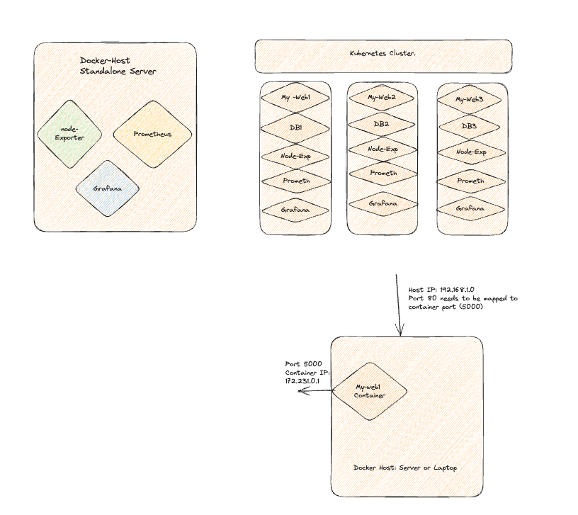

# How to setup Prometheus, Node Exporter and Grafana

## What is Node Exporter?
Node exporter is responsible for fetching the statistics from various hardware and virtual resources in the format which Prometheus can understand and with the help of the prometheus server those statistics can be exposed on port 9100.

There are many third-party Node exporters which can be used by SREs as well as DevOps based on their application needs. But primarily we look for the following metrics -

- CPU usage
- Memory usage
- Disk usage
- Network usage

## What is Prometheus?
It is an open-source tool for scrapping the performance metrics of any given hardware resource (CPU, VM, Cloud Virtual Machine, Router, etc.). Prometheus scraps the data with the timestamp which can be stored on a server and accessed using the PromQL. Prometheus has superb support API which makes Prometheus integration with any resource present in the Datacenter. Prometheus architecture is really scalable and 3rd party libraries and makes it more powerful.

## Main Prometheus Server components:
- Retrieval : Puls metrics data
- Storage : Stores metric data
- Http Server: Accepts query (PromQL or through Grafana "Data visulization tool")

## What is Grafana? 
In Lehman's term Grafana is a User interface for viewing the metrics scraped by Prometheus from various resources. Grafana is an open-source analytics and visualization tool. Grafana does not store any data, but instead, it relies on Prometheus to send the data so that dashboard can be prepared. Also, Grafana is used for sending notifications and mail alerts based on various thresholds. One of the cool features of the Grafana is Grafana Labs where you can go and download the dashboard prepared by other developers so that you do not have to re-invent the wheel.

